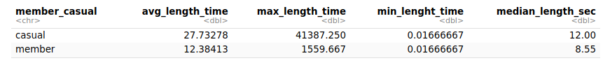

# Data-Analytics-Capstone-Bike-Share-Cyclistic
**
Caso Practico: Análisis del uso compartido de bicicletas ( Google Data Analytics professional Certificate) <br>
Hago uso de R y RStudio para el Analisis de datos.


## Preguntar 

#### Escenario
Cyclistic, es una empresa de bicicletas compartidas de Chicago. La directora de marketing cree que el éxito futuro de la empresa depende de maximizar la cantidad de membresías anuales. Por lo tanto, tu equipo quiere entender qué diferencias existen en el uso de las bicicletas Cyclistic entre los ciclistas ocasionales y los miembros anuales. A través de estos conocimientos, tu equipo diseñará una nueva estrategia de marketing para convertir a los ciclistas ocasionales en miembros anuales. Sin embargo, antes de eso, los ejecutivos de Cyclistic deben aprobar tus recomendaciones; por eso, debes respaldar tu propuesta con una visión convincente de los datos y visualizaciones profesionales de los mismos. 


#### stakeholders

*Lily Moreno:* La directora de marketing.Moreno es responsable del desarrollo de campañas e iniciativas para promover el programa de bicicletas compartidas. Las campañas pueden incluir correo electrónico, redes sociales y otros canales. 

*Equipo de análisis computacional de datos de marketing de Cyclistic:* Un equipo de analistas de datos que se encargan de recopilar, analizar e informar datos que ayudan a conducir la estrategia de marketing de Cyclistic. 

*Equipo ejecutivo de Cyclistic:* El equipo ejecutivo, sumamente detallista, decidirá si aprueba el programa de marketing recomendado. 


#### Tarea empresarial

¿Cómo puede Cyclistic convertir a los ciclistas ocasionales en miembros anuales y maximizar la cantidad de membresías anuales para garantizar el éxito futuro de la empresa de bicicletas compartidas en Chicago?


#### Preguntas para analizar

* ¿Cuál es el porcentaje actual de ciclistas ocasionales y miembros anuales en el total de usuarios de las bicicletas compartidas?

* ¿Cuáles son las diferencias clave en el uso de las bicicletas Cyclistic entre los ciclistas ocasionales y los miembros anuales? Respecto a:
  * El tiempo de uso de la bicicleta.
  * Los días que más usan las bicicletas y el tipo de bicicletas
  * El horario durante el día en el que recogen la bicicleta para hacer uso del servicio
    
* ¿En qué se diferencian los socios anuales y los ciclistas ocasionales con respecto al uso de las bicicletas de Cyclistic?  


## Preparando los datos

Se usará *datos históricos* de los últimos 12 meses (Julio de 2022 a Junio del 2023),  Los datos ha sido proporcionados por *Motivate Internacional Inc, siendo datos públicos.* Los *datos personales*  de los usuarios son *anonimizados*.

```{r Importando datos}

#Importando datos 
bike_trips_2022_07_df <- read_csv("202207-divvy-tripdata.csv")
bike_trips_2022_08_df <- read_csv("202208-divvy-tripdata.csv")
bike_trips_2022_09_df <- read_csv("202209-divvy-publictripdata.csv")
bike_trips_2022_10_df <- read_csv("202210-divvy-tripdata.csv")
bike_trips_2022_11_df <- read_csv("202211-divvy-tripdata.csv")
bike_trips_2022_12_df <- read_csv("202212-divvy-tripdata.csv")
bike_trips_2023_01_df <- read_csv("202301-divvy-tripdata.csv")
bike_trips_2023_02_df <- read_csv("202302-divvy-tripdata.csv")
bike_trips_2023_03_df <- read_csv("202303-divvy-tripdata.csv")
bike_trips_2023_04_df <- read_csv("202304-divvy-tripdata.csv")
bike_trips_2023_05_df <- read_csv("202305-divvy-tripdata.csv")
bike_trips_2023_06_df <- read_csv("202306-divvy-tripdata.csv")

```

Creo una lista de los dataframe para facilitar la aplicación de las funciones de verificación correspondientes.

```{r}
# Lista con los data frames
bike_trips_list <- list(
  bike_trips_2022_07_df,
  bike_trips_2022_08_df,
  bike_trips_2022_09_df,
  bike_trips_2022_10_df,
  bike_trips_2022_11_df,
  bike_trips_2022_12_df,
  bike_trips_2023_01_df,
  bike_trips_2023_02_df,
  bike_trips_2023_03_df,
  bike_trips_2023_04_df,
  bike_trips_2023_05_df,
  bike_trips_2023_06_df
)

```


Verifico la estructura de los datos para asegurarme de que estén completos, correctos, relevantes para el análisis y libres de incongruencias.

```{r Estrucutura de los datos}

# Itero sobre la lista para obtener la estructura de cada df
for (df in bike_trips_list) {
  print(str(df))
}

```


**Sobre la credibilidad de los datos recopilados:**

*Los datos son confiables*, ya que se ha mantenido un registro detallado de la población durante los últimos doce meses en un sistema dedicado. La consistente cantidad de viajes de bicicleta registrados, que oscila entre un máximo de 823,488 y un mínimo de 181,806 en diferentes meses, respalda la confiabilidad de la recolección de datos.

*Los datos son originales*, ya que provienen directamente de los dispositivos incorporados en las bicicletas, lo que garantiza la autenticidad y actualidad de los datos. Al obtener los datos directamente de la compañía, se evitan posibles manipulaciones o errores de terceros.

*Los datos están completos y bien estructurados*, ya que se incluyen todas las variables relevantes para el análisis, como la identificación por usuario, el tipo de bicicleta, el tiempo de trayecto y el tipo de miembro. Aunque se tienen datos adicionales de latitud y longitud, se reconoce que no son necesarios para el análisis específico realizado.

*Los datos son actuales*, ya que se han recopilado y analizado los viajes en bicicleta de los últimos doce meses, desde julio de 2022 hasta junio de 2023. Esto garantiza que el análisis refleje la situación actual y reciente de los patrones de uso de las bicicletas.


## Procesando

Para comenzar la limpieza de datos, es necesario verificar tanto los nombres de las columnas como los formatos utilizados. Esto me permitirá fusionar la información en un solo dataframe y, de esta manera, facilitar tanto el proceso de limpieza como el análisis.

*Verificando las columnas*

```{r}

# Iterar sobre la lista y obtener los nombres de las columnas
for (df in bike_trips_list) {
  
  print(colnames(df))
}

```
*Apilando todos los dataframen en uno solo*


```{r convirte en un Big Dataframe}
all_bike_trips <- bind_rows(bike_trips_list)
```
Se obtiene un solo dataframe , con 5,778,870 registros 

*Seleccionando columnas de interés*

```{r}
bike_trips_df <- all_bike_trips %>%
  select(-c(start_lat,start_lng,end_lat,end_lng))
```


*Verificando los valores na, en las columnas start_station_name, start_station_id, end_station_name y end_station_id*

```{r}
na_start_station_name <- bike_trips_df %>% 
  filter(is.na(start_station_name))

```

Aunque hay valores nulos  en las cuatro columnas no afecta en análisis, por eso los conservo para seguir con el análisis


*Eliminado valores duplicados en resgistros y atributos*

```{r}
all_bike_trips_df <- bike_trips_df %>%
  distinct(.keep_all = FALSE)
```
No se eliminó ninguna fila porque cada registro es único


*Agregación de información ride_length en formato numérico*

```{r}
all_bike_trips_df <- all_bike_trips_df %>%
  mutate(ride_length_sec = difftime(ended_at, started_at, units = "secs" ) )

```

Convirtiendo la variable ride_length del formato "time" al formato "numeric"
```{r}
all_bike_trips_df <- all_bike_trips_df %>%
  mutate(ride_length_sec = as.numeric(ride_length_sec))
```
Busco valores que no cumplen con los valores esperados de la columna ride_length que deben ser positivos y numéricos.

```{r}
negative_ride_length_df <- 
  all_bike_trips_df[!grepl("^[0-9*\\.?[0-9]+$", all_bike_trips_df$ride_length_sec), ]

```
Han aparecido valores negativos que no cumplen con la validación

Creo un nuevo df con el filtro aplicado, llamado bike_share_data, este sera el df para el análisis.
```{r}
bike_share_data <- all_bike_trips_df %>%
  filter(ride_length_sec > 0)
```
---------------------------------------------

*Convirtiendo la duración de los viajes de segundos a horas*

```{r}
bike_share_data <- bike_share_data %>%
  mutate(ride_length_min = ride_length_sec/60)
```


## Analisis


*¿Cuál es el porcentaje actual de ciclistas ocasionales y miembros anuales en el total de usuarios de las bicicletas compartidas?*

```{r}
summary_bike_share_user_percet <- bike_share_data %>%
  group_by(member_casual) %>%
  summarize(num_user =  n(), percet = (n()/sum(nrow(bike_share_data)))*100, .groups = "drop" )
```


El porcentaje actual de ciclistas miembros es del 61.17 % y el porcentaje de ciclistas casuales es del 38.83% 
<br>

*¿Cuáles son las diferencias clave en el uso de las bicicletas Cyclistic entre los ciclistas ocasionales y los miembros anuales? Respecto a:*

**Tiempo de uso por tipo de usuario.**

Sacar la media, el máximo y el min tiempo de uso por los ciclistas miembros y los ocasionales

```{r}
summary_bike_share_ride_length <- bike_share_data %>%
  group_by(member_casual) %>%
  summarize(avg_length_time = mean(ride_length_min), max_length_time = max(ride_length_min),
            min_lenght_time =  min(ride_length_min),median_length_sec = median(ride_length_min) )

```


Aquí se puede observar que los ciclistas casuales presentan un promedio de tiempo de uso superior al de los ciclistas miembros. Los valores máximos en el grupo casual son notablemente altos, lo cual puede deberse a casos atípicos o eventos excepcionales. De igual manera, se debe considerar la posibilidad de valores mínimos provocados por situaciones accidentales.

Es importante realizar un análisis de valores atípicos para evaluar la influencia de estos casos extremos en las conclusiones. Asimismo, se puede observar que menos del 50% de los ciclistas casuales tienen tiempos de uso de al menos 12 minutos, mientras que en el caso de los miembros, el 50% tiene un tiempo de uso inferior a 8.55 minutos, lo que sugiere una clara diferencia en los patrones de uso entre ambos grupos.

El tiempo de uso parece ser mayor en los ciclistas casuales en comparación con los miembros, lo que podría indicar que los primeros utilizan las bicicletas compartidas durante periodos más largos, mientras que los miembros pueden hacer uso de las bicicletas para recorridos más cortos.

**Rango horario en el que hacen uso del servicio**
  
Generando una nueva columna y reordenando los días
```{r}

#Creando la columna
bike_share_data <- mutate(bike_share_data,day_of_week = weekdays(started_at))

#ordenando
bike_share_data$day_of_week <- factor(bike_share_data$day_of_week, levels = c("domingo", "lunes", "martes", "miércoles","jueves","viernes","sábado"))

```

Calculando el promedio de duración, por día de la semana, por tipo de usuario

```{r}
summary_bike_share_avg_time_day <- bike_share_data %>%
  group_by(member_casual, day_of_week) %>%
  summarize(avg_length_min = mean(ride_length_min), .groups = "drop") 

```


Se puede observar que el promedio de tiempo de uso para los usuarios casuales es mayor los domingos, sábados, lunes y viernes. Por otro lado, los miembros tienen un mayor promedio de tiempo de uso los sábados, domingos, viernes y jueves.

Esta tendencia sugiere que los usuarios casuales tienden a utilizar más las bicicletas compartidas durante los días de fin de semana y principios de semana, posiblemente para actividades recreativas o turísticas. Mientras tanto, los miembros hacen un uso más constante durante los días de fin de semana y finales de semana, lo que podría estar relacionado con su uso para desplazamientos diarios o actividades regulares.

  
**Que franjas horarias del día, hacen uso los clientes casuales y los miebros ?**

```{r}


# Definir función para obtener la etiqueta de la franja horaria
franja_dia <- function(hour) {
  case_when(
    hour >= 0 & hour < 6 ~ "madrugada",
    hour >= 6 & hour < 12 ~ "mañana",
    hour >= 12 & hour < 18 ~ "tarde",
    TRUE ~ "noche"
  )
}


# Crear la columna hour con las horas del día
bike_share_data <- bike_share_data %>%
  mutate(hour = hour(started_at))

# Crear la columna time_slot con las etiquetas de la franja horaria
bike_share_data <- bike_share_data %>%
  mutate(horario = franja_dia(hour))

#ordenadp
bike_share_data$horario <- factor(bike_share_data$horario , levels = c("madrugada", "mañana", "tarde", "noche"))

# Calcular el promedio de recorrido por franja horaria y tipo de usuario
summary_bike_share_data_franja <- bike_share_data %>%
  group_by(member_casual,horario) %>%
  summarize(avg_ride_length_min = mean(ride_length_min), .groups = "drop")

```


En cuanto a la jornada, los ciclistas casuales presentan un tiempo de uso promedio mayor en la madrugada, seguida de la tarde y la noche. Por otro lado, los miembros tienen una duración promedio del viaje mayor en la noche, seguida de la madrugada y la mañana.


## Visualizacion


**Visualizando del numero de viajes por dia por tipo de usuario y Tipo de Bicileta**


```{r}
ggplot(data = bike_share_data) + 
  geom_bar(mapping = aes( x = day_of_week, fill = rideable_type )) + 
  facet_wrap(~member_casual) +
  theme(axis.text.x = element_text(angle = 45, hjust = 1, vjust = 1)) + 
  labs(title = "Numero de viajes por dia por tipo de usuario y Tipo de bicicleta", 
       x = "Día de la semana", y ="Número de viajes", fill = "Tipo de Bicicleta") 
```


El análisis de datos muestra patrones interesantes en el uso de las bicicletas compartidas por parte de los clientes casuales y miembros. Se puede observar que:

*Los días con el mayor número de viajes de clientes casuales son los sábados y domingos, mientras que los clientes miembros realizan más viajes los miércoles y jueves. Esta diferencia en los días de mayor uso sugiere que los clientes casuales tienden a utilizar las bicicletas compartidas más frecuentemente durante los fines de semana no laborables, posiblemente para actividades recreativas o turísticas, mientras que los clientes miembros las utilizan más para desplazamientos durante los días laborables.

*Los clientes casuales muestran una preferencia por las bicicletas eléctricas en comparación con las bicicletas de estación y las clásicas. Por otro lado, los clientes miembros utilizan tanto las bicicletas clásicas como las eléctricas, pero no hacen uso de las bicicletas de estación. Esta diferencia en las preferencias puede estar relacionada con la mayor flexibilidad que ofrecen las bicicletas eléctricas para recorrer distancias más largas y facilitar el desplazamiento en terrenos difíciles.

*La observación sobre el uso de las bicicletas de estación puede indicar que los clientes miembros prefieren la comodidad de poder estacionar cerca de su destino, lo cual es posible con las bicicletas clásicas y eléctricas que pueden ser dejadas en lugares permitidos. En cambio, las bicicletas de estación requerirían ser devueltas a una estación específica, lo que podría ser menos conveniente para algunos usuarios.


**Visualizando el numero de viajes por horario del día y Tipo de usuario **

```{r}
ggplot(data = bike_share_data) + 
  geom_bar(mapping = aes( x = horario, fill = member_casual )) + 
  facet_wrap(~member_casual) +
  theme(axis.text.x = element_text(angle = 45, hjust = 1, vjust = 1)) + 
  labs(title = "Numero de viajes por Jornada del día y Tipo de usuario",
       x = "Día de la semana", y ="Número de viajes", fill = "Tipo de Usuario") 
```

Puede afirmarse que:

Los clientes casuales tienden a realizar la mayoría de sus viajes en la tarde, seguida de la noche y la mañana. Esto sugiere que los clientes casuales utilizan las bicicletas compartidas principalmente para actividades de ocio o recreación durante las horas de la tarde y la noche.

Por otro lado, los clientes miembros realizan la mayoría de sus viajes en la tarde, seguida de la mañana y la noche. Esta diferencia en los patrones de uso entre clientes casuales y miembros puede deberse a que los clientes miembros utilizan las bicicletas compartidas más frecuentemente para desplazamientos y actividades cotidianas durante las horas de mayor actividad laboral y desplazamiento.


**Visualizacion del tiempo de uso y Tipo de usuario**

```{r}
ggplot(data = bike_share_data) +
  geom_jitter(mapping = aes(x=ride_length_sec, y = member_casual)) +
  labs(title = "Tiempo de uso y Tipo de usuario", x = "Tiempo de uso (Seg)",
       y = "Tipo de Usuario", caption = "Datos: Desde 07 2022 al 06 2023")
```


En general, podemos observar que aunque el porcentaje actual de ciclistas miembros es del 61.17% y el porcentaje de viajeros casuales es del 38.83%, los usuarios casuales tienen duraciones de viaje mucho más largas en comparación con los ciclistas miembros.

*Ciclistas casuales:*

*Se identifica un dato atípico entre los ciclistas casuales con una duración de viaje de aproximadamente 28 días (2500000 segundos). Esta duración extremadamente larga podría ser resultado de un error de registro o un viaje excepcionalmente largo, y es necesario investigar más a fondo este valor para determinar su validez.

*Existe otro grupo de datos con duraciones de viaje entre 12 días (1000000 segundos) y 24 días (2000000 segundos). Estas duraciones sugieren que algunos usuarios casuales utilizan las bicicletas compartidas para viajes de varios días, lo que podría estar relacionado con actividades turísticas o recreativas prolongadas.

*También se observa un grupo considerable de ciclistas casuales que alquilan bicicletas para trayectos de 6 días (500000 segundos) a 12 días. Esto indica que algunos usuarios casuales prefieren utilizar las bicicletas compartidas para viajes más extensos, pero no tan largos como el grupo anterior.

*La mayoría de los puntos de datos están concentrados en duraciones de viaje de menos de 6 días (500000 segundos). Esto sugiere que la mayoría de los usuarios casuales realizan trayectos más cortos y rápidos, lo que respalda la idea de que utilizan las bicicletas compartidas para actividades de ocio y desplazamientos dentro de la ciudad.

*Ciclistas miembros:*

*En contraste, la duración de viaje para los ciclistas miembros es menor, con un límite inferior de 3 días (250000 segundos). Esto indica que los miembros utilizan las bicicletas compartidas principalmente para viajes más cortos y puntuales, como desplazamientos al trabajo o actividades cotidianas.

*Se destaca que la duración de viaje para los ciclistas miembros está concentrada principalmente en un solo día. Esto respalda la idea de que los miembros utilizan las bicicletas compartidas para trayectos diarios y se benefician de la conveniencia y eficiencia del servicio para sus desplazamientos.


**Visualizacion del Tiempo promedio de uso por dia por tipo de usuario:**

```{r}

ggplot(data = summary_bike_share_avg_time_day) +
  geom_col(mapping = aes(x=day_of_week, y=  avg_length_min )) + 
  facet_wrap(~member_casual) + 
  theme(axis.text.x = element_text(angle = 45, hjust = 1, vjust = 1)) +
  labs(x = "Días de la semana", y = "Tiempo promedio de uso (min)",
       title ="Tiempo promedio de uso por Día por Tipo de usuario", 
       caption = "Datos: Desde 07 2022 al 06 2023")
```


La visualización muestra claramente que los ciclistas casuales tienen un mayor tiempo promedio de uso los domingos, sábados, lunes y viernes. Por otro lado, los ciclistas miembros tienen un mayor tiempo promedio de uso los días sábados, domingos y viernes.

Este análisis nos permite inferir que los ciclistas casuales tienden a utilizar las bicicletas compartidas durante los fines de semana y al inicio de la semana laboral para realizar trayectos más largos y extensos. Esto puede indicar que los usuarios casuales utilizan las bicicletas para actividades recreativas, turísticas o desplazamientos más largos durante sus días libres y los días laborales iniciales.

En el caso de los ciclistas miembros, también se observa una tendencia similar a los fines de semana y los días laborales previos al fin de semana. Es posible que los miembros también utilicen las bicicletas compartidas para actividades de ocio o recreación durante sus días de descanso.


## Actuar

### Descubrimientos Claves

*El análisis de datos realizado ha proporcionado información valiosa sobre las diferencias en el uso de las bicicletas compartidas entre los ciclistas ocasionales y los miembros anuales de Cyclistic. Se ha identificado que los ciclistas casuales tienden a utilizar el servicio principalmente para actividades de ocio y desplazamientos más largos, mientras que los miembros realizan un uso más regular y puntual para sus desplazamientos diarios.

*Los ciclistas ocasionales prefieren más las bicicletas eléctricas, por encima de las clásicas y las de estación o Docker bikes en menor medida, mientras que los ciclistas con membresía anual tiene preferencias tanto de las bicicletas eléctricas como las clásicas.

*Las recomendaciones propuestas, como la promoción de membresías anuales durante los fines de semana, programas de fidelización para ciclistas ocasionales y la mejora de la experiencia para usuarios miembros, tienen como objetivo convertir a los ciclistas ocasionales en miembros anuales y maximizar la cantidad de membresías anuales para garantizar el éxito futuro de Cyclistic.

*La implementación de estas recomendaciones, respaldadas por datos y análisis sólidos, puede ayudar a Cyclistic a alcanzar sus objetivos de negocio y consolidarse como una empresa líder en el mercado de bicicletas compartidas en Chicago.

### Recomendaciones

* Recomendacion 1
* Recomendación 2
* Recomendacion 3

  
